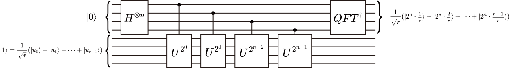

# Quantum Algorithms

## Deutsch Jozsa algorithm

- Significance: First algorithm to demonstrate quantumness
- Problem: Determine a hidden function is constant or balanced
- Algorithm: 
- Implementation

### Exercises

1. Implement a DJ N=3 Constant circuit
2. Implement a DJ N=3 Balanced circuit

## Grover’s algorithm

- Significance: Quadratic speed up
- Problem: Unstructured search problem

- Algorithm: 

- Implementation:

### Exercises
 
1. Implement Grover N=2, A=01
2. Implement Grover N=3, A=010, 1 iteration
3. Implement Grover N=3, A=011, 2 iterations

## Shor’s algorithm

- Significance: Exponential speed up
- Problem: Factorization

Period finding
Modular arithmetic

- Algorithm: 

Quantum fourier transform
Quantum phase estimation

Classical part
Quantum part: period finding subroutine

- Implementation:

### Exercises

