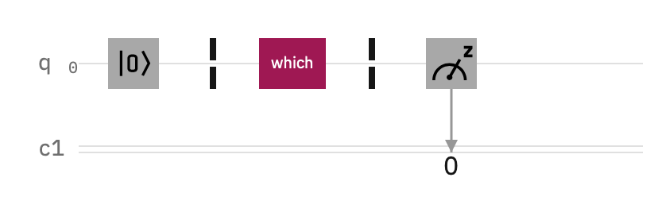
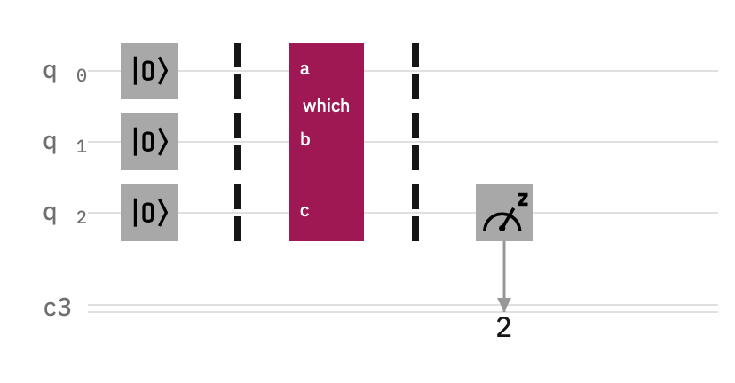
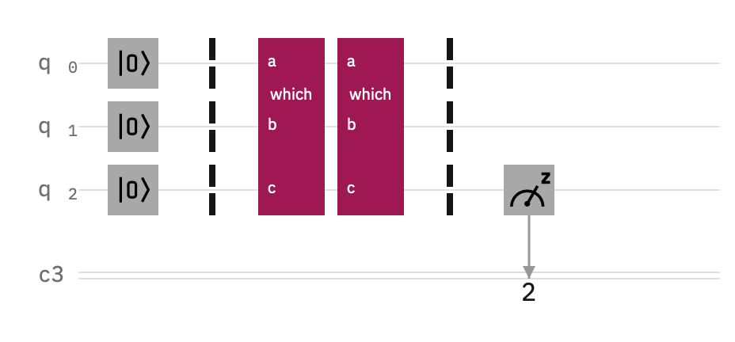
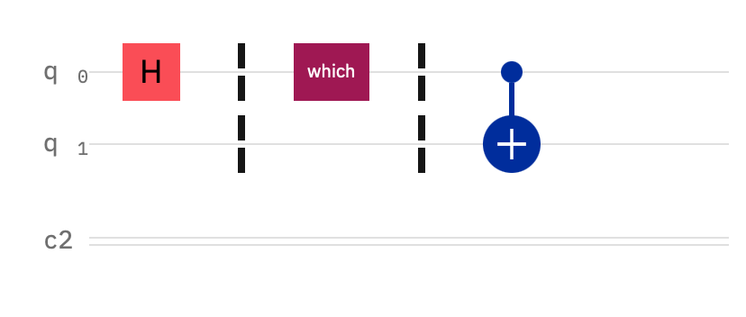
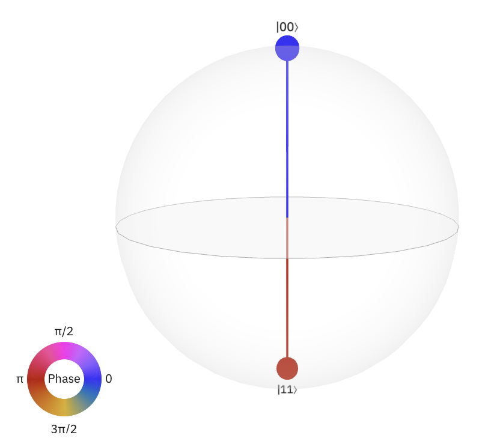
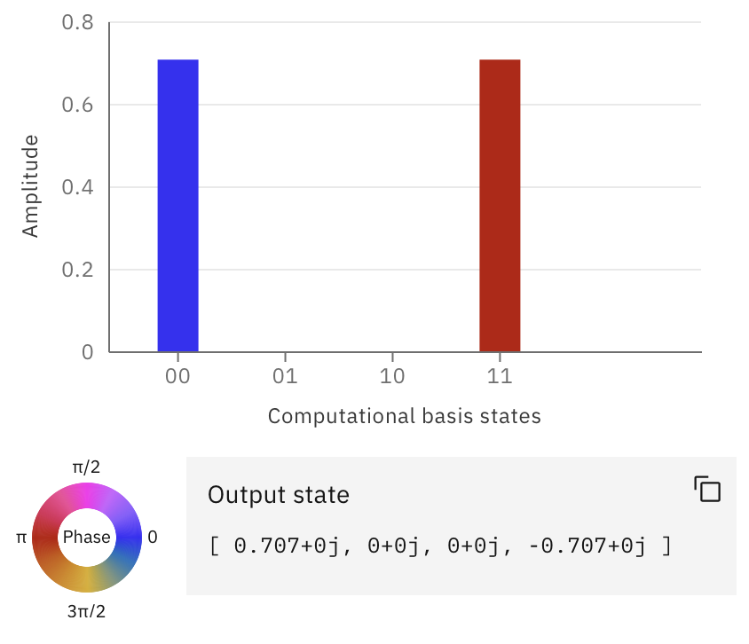
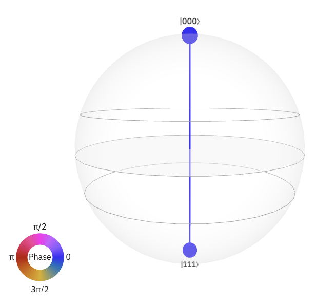
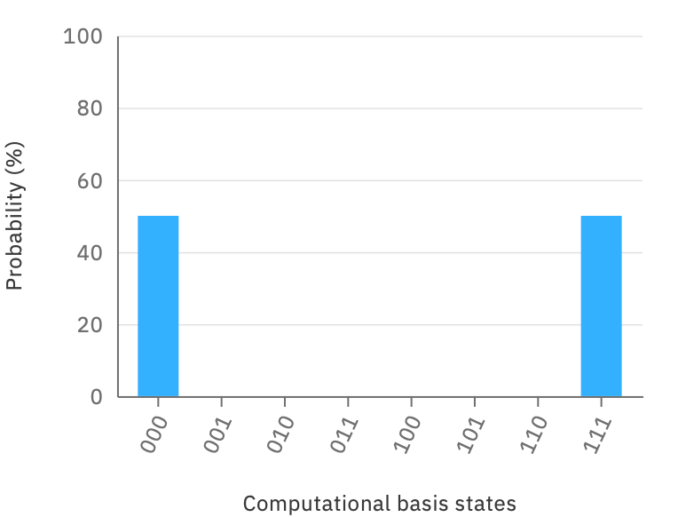
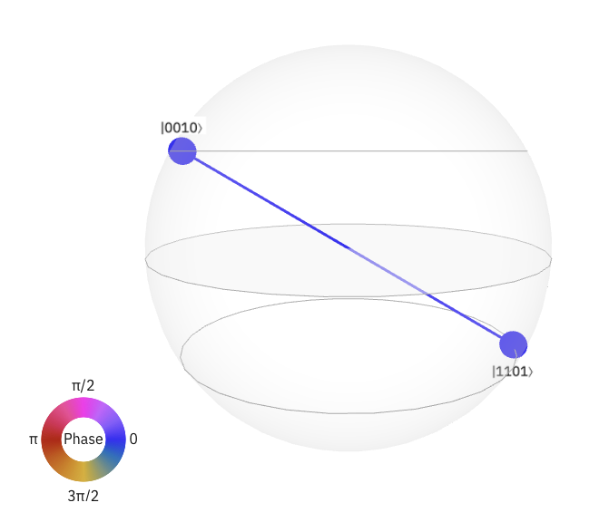

# Hands-on Session

## Learning outcome

- Single qubit gate
- CX gate
- Barrier
- Extend barrier
- Choose control node
- Understand probability
- Understand statevector (phase angle)
- Understand qsphere

## Hands-on sessions

- Classical logic gates
    - NOT gate

    - AND gate

    - XOR gate

- $\Phi^-$ Bell state circuit

- GHZ state circuit

- Qiskit logo circuit

Change inputs

