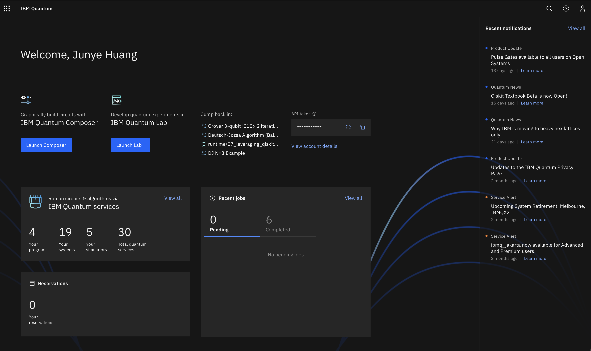
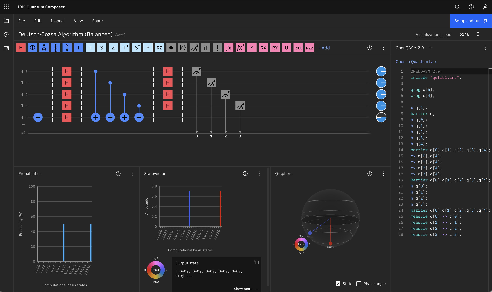
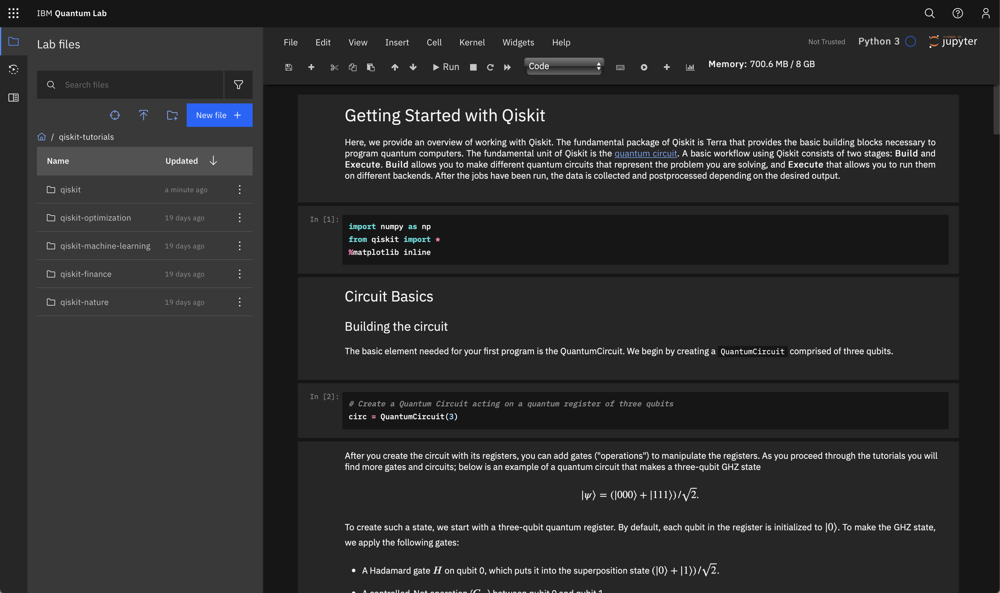
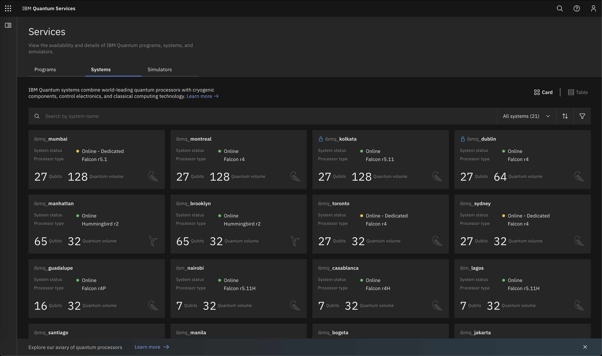
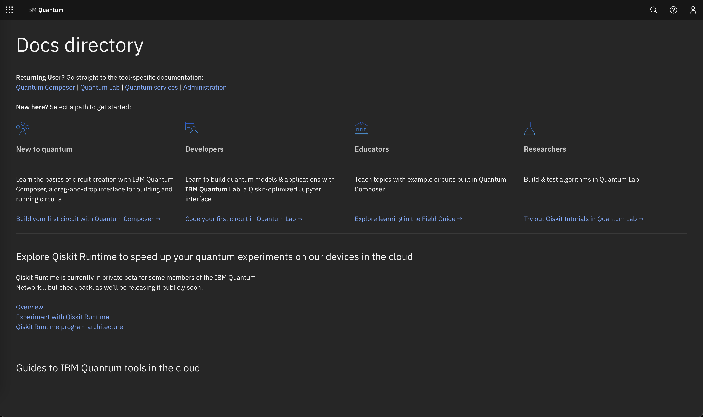

# Quantum Computing Lab

TODO
Need to mention
- Qiskit community

# IBM Quantum Platform

- What is IBM Quantum platform?
    - Quantum system on the cloud
    - A platform to run quantum circuits, programs on real quantum systems and simulators
    - Since 2016 May 4
    - Xxx users, trillion circuits, 2 billion circuits per day
    - Xx systems online
    - Xxx papers published
- Register an IBM Quantum account

## IBM Quantum Composer

- A visual drag-and-drop tool for composing quantum circuits and run on real quantum systems and simulators
- Qubit lines
    - Qubits
    - Classical bits
- Quantum gates
    - X gate
    - H gate
    - CX gate
    - Measurement operation
    - Barrier
- Visualizations
    - Statevector
    - Probability
    - Q-sphere
    - Phase disk
    - Insert break point and step through
- Code panel
    - OpenQASM
    - Qiskit
- Run on hardware / simulators
    - Choose backend
        - Run
## IBM Quantum Lab (will not be covered in this course)

- A Jupyter-lab based python environment that runs Qiskit, IBM’s open source quantum SDK. Allows much more complicated quantum operations
- Qiskit
    - Programming in the level of circuits, pulses
    - Transitioning
    - Qiskit-terra: core modules
    - Qiskit-aer: high performance quantum simulator
    - Qiskit applications modules
        - Nature
        - Finance
        - Optimization
        - QML
        - Dynamics
    - Qiskit-experiments
    - Qiskit runtime
    - Qiskit partners
        - IBM provider
        - Honeywell
        - IonQ
        - AQT
- Run getting started with Qiskit tutorial (same as the composer demo) (just to run through, won’t go into details)
- Qiskit tutorials
    - Qiskit textbook chapters
## IBM Quantum Services

- Programs, Systems, Simulators
- Systems
    - Superconducting qubits
    - System type
        - Open
        - Premium
    - Qubit count
    - Quantum volume
    - Status
    - Coupling map
        - Nodes are qubits
        - Connections are microwave resonators
    - Specs
        - Frequency
        - T1
        - T2
        - Single qubit error rate
        - CNOT error
    - OpenPulse: microwave pulse level control
- Simulators
    - Qasm_simulator (32 qubits): generic, like real devices
    - Simulator_statevector (32 qubits): computing wavefunction of the statevector
    - More advanced simulators
        - Extended_stabilizer (63 qubits)
        - Matrix_product_state (100 qubits)
        - Stabilizer (1000 qubits)
- Programs (will not be covered in this course)
    - Qiskit runtime: hybrid classical quantum program on the cloud, accelerating hybrid quantum algorithms (near term applications)
        - 120x speed up when combined with other techniques
    - Vqe (chemistry)
        - Quantum-kernal-alignment (QML)
## Documentation

- IBM Quantum Documentation
    - User type:
        - New to quantum
        - Developers
        - Educators
        - Researchers
- Qiskit documentation
    - API references
    - Qiskit tutorials
        - Qiskit textbook
